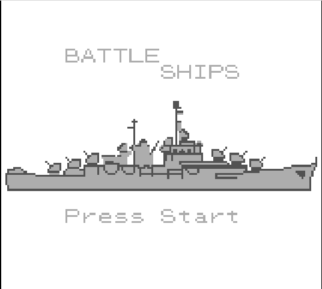
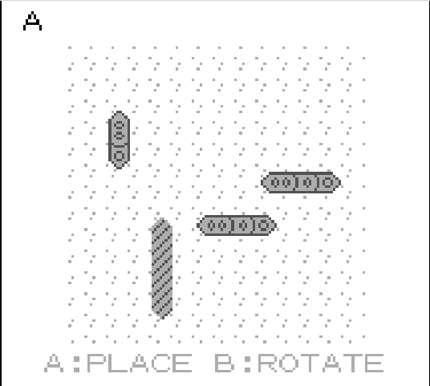
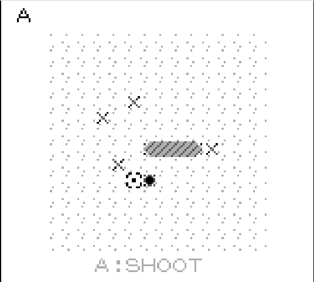
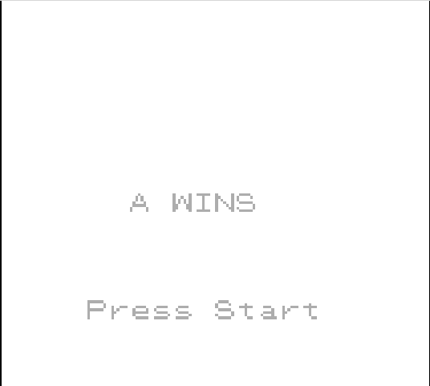

# Battleships!
Essex CSEE Society Hackathon 2023 Project

This is a battleships game for the Nintendo Gameboy, it is written in C using GBDK-2020.

The game is intended to be a 2-player game that you can pass back and forth with another player.

## Screenshots

Titlescreen

Place your boats in secret

Attempt to fire and hit your opponent's boats

Game over, player A has won

